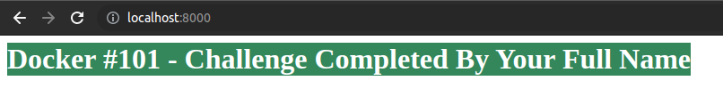

## Docker Session I - Hands-On Labs

### Prerequisite

---

Following are the prerequisite for the Hands-On Session.

#### 1. Create a Docker Hub id

Visit https://hub.docker.com/signup - use your personal email

#### 2. Verify Email Address

You will receive an email to confirm the Docker Hub account, once confirmed, your account is created with Docker Hub.

#### 3. Accessing Docker Lab

This is a free online lab environment for Docker, you can access it using the Docker Hub account create using the above steps, 

visit https://labs.play-with-docker.com/ and click on Login. 

This will open up a pop-up for login, ensure you don’t have pop-up blocker enabled in your browser. 

Once logged in with Docker, you should see the start button, click on Start

#### 4. Add a Docker Instance

Click on ‘ADD NEW INSTANCE’ label under Instance in the left hand side navbar. This will spawn up a docker instance for running lab tasks.

> Congratulations ! You have successfully setup your lab. You can click on close session if you want to close the lab.

---

### Hands-On Labs

### Lab 1 : Run your first container

1. Run a container
2. Run multiple containers
3. Remove the containers

---

#### 1. Run a container

- Verify version of docker
```
docker --version
```

- List docker images
```
docker images
```

- Search docker image for Webserver(Apache HTTPD)
```
docker search httpd
```

- Pull Apache HTTPD docker image
```
docker pull httpd:latest
```

- Verify that Apache HTTPD docker image is pulled successfully or not
```
docker images
```

- Run first container called `containerA`
```
docker run -d -p 8080:80 --name containerA httpd:latest
```

- List running Docker processes
```
docker ps
```

- Test the webserver is deployed in a container or not 
```
curl http://localhost:8080
```

#### 2. Run multiple containers

- Search for `hello-world`
```
docker search hello-world
```

- Pull hello-world docker image
```
docker pull hello-world:latest
```

- Verify that hello-world docker image is pulled successfully or not
```
docker images
```

- Run second container called `containerB`
```
docker run --name containerB hello-world:latest
```

- List running Docker processes
```
docker ps
```

- List all docker processes
```
docker ps -a
```

#### 3. Remove the containers

- List all docker processes
```
docker ps -a
```

- Stop running container
```
docker stop containerA
```

- List all docker processes
```
docker ps -a
```

- Remove all containers
```
docker rm containerA containerB
```

- Verify whether docker containers removed or not 
```
docker ps -a
```

---

### Lab 2 : Run Container For Java Application 

---

1. Build & Run Java application without using Docker
2. Build & Run Java application using Docker
3. Make changes Persistent
4. Push changes to Docker Hub
5. Rerun the container with new image(Persistent Changes)
6. Remove everything

---

#### 1. Build & Run Java application without using Docker(Optional)

> This part 1 require installed Java version 18.

- Clone the Java Application and Change the directory

```
git clone https://gist.github.com/akshayithape-devops/8e8128917a1754595cd155266d8f3aac.git
cd 8e8128917a1754595cd155266d8f3aac
```

- Now build java application with `javac` command.

```
javac helloworld.java
```

- Now run java application with `java` command.

```
java HelloWorld
```

#### 2. Build & Run Java application using Docker

> Note : I already build one custom image for our meetup - akshayithape02/docker101-demo:latest

- Run the Java container 

```
docker run --name javacontainer akshayithape02/docker101-demo:latest
```

- Remove javacontainer 

```
docker rm javacontainer
```

- Run the Java container in Interactive mode

```
docker run -it --name javacontainer akshayithape02/docker101-demo:latest /bin/bash
```

- Run existing java application binary

``` 
java HelloWorld
```

> VIM editor is not installed. So we have to install it.

- Install VIM editor

```
microdnf install vim
```

- Now we have update Java Application Code

```
vim helloworld.java

# Add following line in `System.out.println`

---
Welcome To Docker #101 - Hands-On Lab 2
---

# To save and exit 

:wq
```

- Now we have build new Java application Code

```
javac helloworld.java
```

- Run Java Application 

```
java HelloWorld
```

- Now exit the container

```
exit
```

#### 3. Make changes Persistent

- Commit the changes

```
docker commit --change='CMD ["java", "HelloWorld"]' javacontainer helloworld:v2
```

- Check the docker images

```
docker images
```

- Remove the container

```
docker rm javacontainer
```

- Run the container with new image 

```
docker run --name helloworldcontainer helloworld:v2
```

- Remove the container

```
docker rm helloworldcontainer
```

#### 4. Push changes to Docker Hub

- Docker login 

```
# Format
docker login -u username -p password/token
```

- Tag the docker image

```
docker tag helloworld:v2 akshayithape02/docker101-demo:v2
```

- List the docker image

```
docker images
```

- Push image to DockerHub

```
docker push akshayithape02/docker101-demo:v2
```

- Vist the docker hub and verify that your image is pushed or not

```
Browse https://hub.docker.com/
```

#### 5. Rerun the container with new image(Persistent Changes)

- Run the container with new image 

```
docker run --name helloworldcontainer akshayithape02/docker101-demo:v2
```

#### 6. Remove everything

- Clean up the containers
```
docker system prune
```

- Clean up the images
```
docker rmi -f $(docker images)
```

---

### Challenge : Run Container For HTML Page

---

- Build docker image with following HTML contents.



- Publish that image on your Docker Hub Account.
- Share that image name with me. 
- When I will run container with that image. It should print same output as above.